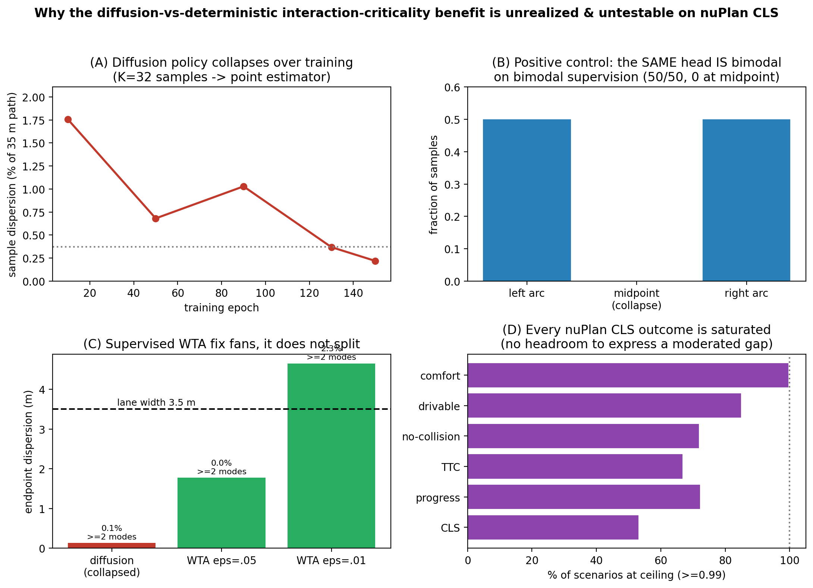

# When Multimodality Doesn't Help: A Diagnostic of Diffusion Planners on nuPlan Closed-Loop

*Frontier-upgrade writeup. Branch `frontier-upgrade`. All numbers trace to committed artifacts and
ADRs (DECISIONS.md ADR-027..036); see Reproducibility.*

## Abstract

Diffusion and other generative planners are widely motivated by their ability to represent a
**multimodal** distribution over futures — the intuition that at a junction or an unprotected turn, a
generative policy can keep "go" and "yield" as distinct options where a regressor must average them.
We set out to test a sharp version of this intuition on the nuPlan closed-loop benchmark: *does the
closed-loop advantage of a diffusion policy over a capacity-matched deterministic policy grow with
scene interaction-criticality?* Across a pre-registered 2x2 (head ∈ {deterministic, diffusion} ×
goal ∈ {route, precise}, 3 seeds, N=800 scenarios, both reactive modes), the answer is a clean null.
But the contribution is *why* the question cannot be answered as usually posed. We show, with a
controlled positive control and corrected inference, that **(i)** the diffusion policy trained by
standard single-future imitation collapses to a near-deterministic point estimator (its closed-loop
trajectories sit a median 0.47 m from the deterministic policy's on a 35 m horizon); **(ii)** this is
a property of the data/training, not the architecture (the same head recovers a clean bimodal
distribution on synthetic bimodal supervision); **(iii)** the standard supervised fix
(winner-take-all multi-hypothesis) widens the prediction into a fan but does not split it into
distinct maneuvers; and **(iv)** every standard nuPlan closed-loop metric is saturated (41–100% of
tokens at ceiling), so the outcome could not express a moderated gap even if one existed. Under the
pre-registered inference the original analysis omitted (scenario_type fixed effects, wild-cluster
bootstrap, TOST), the null holds and is *equivalent to zero*, it **survives removal of the ceiling**,
and the directional prediction is reversed at its leverage point. The assumed multimodal benefit is
therefore, on standard nuPlan closed-loop, both **unrealized** and **untestable as set up**. This is
a measurement/method result in the lineage of Dauner et al., *Parting with Misconceptions* (CoRL
2023); the collapse leg is independently confirmed by DIVER (arXiv:2507.04049, 2025).

*Figure 1. (A) the diffusion policy collapses over training; (B) positive control -- the same head is bimodal on bimodal supervision; (C) the supervised WTA fix fans, it does not split; (D) every nuPlan CLS outcome is saturated.*

## 1. Motivation

The case for generative (diffusion) planners over deterministic regressors rests heavily on
multimodality: a regressor trained to imitate a single expert future minimizes MSE by predicting the
*conditional mean*, which at a genuine decision point is a blend of incompatible maneuvers, whereas a
diffusion model can in principle keep the modes separate. If true, the benefit should be largest
exactly where the scene is interaction-critical. We test that prediction directly, and — finding no
effect — we diagnose the cause rather than report a bare null.

## 2. Setup (pre-registered)

- **Policies.** A shared scene encoder + a capacity-matched twin head: `DeterministicHead`
  (regression) vs `DiffusionHead` (x0-prediction, cosine schedule T=100, DDIM K=8, medoid selection
  at deployment). Goal axis: route-region (no goal token) vs precise (pinned 4 s/8 s waypoints).
- **Moderator.** F4 = interaction-criticality (G_stop · noisy-OR of branch presence and space-time
  interaction-conflict), frozen and hashed before any closed-loop score was seen (ADR-027/028).
- **Outcome.** Official nuPlan closed-loop score (CLS), seed-averaged; two reactive modes (non-
  reactive box-replay r0, reactive IDM r1).
- **Test.** Per-token Δ = CLS(diffusion) − CLS(deterministic); moderation Δ ~ F4; headline = the
  route-minus-precise contrast of F4 slopes, predicted > 0. N set by an a-priori power analysis.

## 3. Findings

**F1 — the moderation is null.** Headline contrast under the corrected inference (scenario_type
fixed effects + wild-cluster bootstrap + TOST; bootstrap self-test validated): r0 β1 = −0.003,
p = 0.77, **TOST-equivalent to 0**; r1 β1 = +0.003, p = 0.83. All PDM sub-components null. The
corrected method also overturns a spurious effect the shipped plain-HC3 would have reported
(drivable-area r0: HC3 t = −1.8 → wild-cluster p = 0.19). [ADR-033]

**F2 — the diffusion policy collapsed.** Open-loop probe: K=32 head samples per scene disperse only
~0.13 m endpoint (0.37% of a 35 m path); 99.95% single-mode. 3-seed robust; develops over training
(~8× contraction); not an EMA artifact. Capstone: the deployed diffusion policy and the deterministic
one differ by a median 0.47 m ADE — functionally near-copies. The "multimodality" treatment was
effectively absent. [ADR-029]

**F3 — the architecture is not at fault.** A controlled synthetic-bimodal test (32 contexts each
mapping 50/50 to two arcs 24 m apart, same head + objective + sampler) recovers both modes perfectly:
modes mean 2.0, 100% of contexts cover both arcs, zero mass at the collapse midpoint. So F2 is a
property of single-future-per-scene imitation, not the model. [ADR-030]

**F4 — "available multimodality" is not measurable by proxy (retracted).** Estimating the data's
per-scene future ambiguity by k-NN over scene context is proxy-dependent: the dispersion swings 3–12 m
with the similarity choice (degenerate random-encoder 3.14 m; interpretable same-type match 5.64 m;
tightest scalar-match pair 12.4 m), because none is a true matched context. The kNN approach cannot
establish per-scene ambiguity from single-future data; we retract the earlier "the data holds
discarded multimodality" claim and rest the conclusion on F5. [ADR-031→036]

**F5 — the standard fix fans, it does not split.** A winner-take-all multi-hypothesis head (M=6),
trained full-scene with relaxed-WTA, produces a wider but still unimodal prediction: endpoint
dispersion 1.8 m (eps=0.05) to 4.6 m (eps=0.01, sharper), but ≥2 distinct modes in only ~2–3% of
scenes — even at decision-point types (traffic-light intersections), best-of-M minADE 0.35 m
(accurate). Conditioning on the *entire* scene, the future is largely determined; the supervised fix
cannot manufacture modes the data does not contain. [ADR-032]

**F6 — the metric is saturated and the null is ceiling-robust.** Every standard nuPlan CLS outcome is
at ceiling (CLS 41–53%, progress 69–72%, comfort ~100%, drivable-area 83–85%, TTC 54–67%, collisions
58–72% of tokens at ≥0.99); the continuous open-loop L2 is not populated in closed-loop. Yet the null
**survives ceiling removal** (null on unsaturated hard subsets, frac-at-ceiling 0.0) and the direct H1
prediction is **wrong-signed** at the high-F4 leverage point (mean Δ_route − Δ_precise = −0.009/−0.010).
So the null reflects treatment collapse, not merely metric saturation. [ADR-033/034]

## 4. Contribution

For the standard nuPlan closed-loop setup (this scenario set, this architecture, single-future
imitation + medoid selection), the much-assumed multimodal benefit of diffusion / multi-hypothesis
planners is both **unrealized** (the policy collapses to a unimodal point estimator) and **untestable
as usually posed** (treatment collapse and a saturated metric each independently block detection). The
contribution is not the null but the chain of controlled diagnostics that explains it and the corrected,
ceiling-robust inference that makes it defensible — including a positive control isolating the cause to
the data, and a demonstration that the standard supervised fix does not recover modes.

## 5. Limitations (honest scope)

- nuPlan-mini (≈5,600 scenarios, Vegas-skewed), one encoder/head family, supervised training only.
  We do **not** claim multimodality is useless for driving in general — only that here it is neither
  present nor measurable.
- F4 is a geometrically-validated interaction-conflict score; it failed human ambiguity validation
  twice, so it is used as a covariate, not as a validated "decision-ambiguity" axis.
- The WTA de-risk is de-risk-scale (16k scenes, 4k steps); it bounds, not exhausts, the supervised-fix
  space.
- Demonstrating a genuine benefit would require **both** a non-collapsed policy (e.g. RL-based
  diversity à la DIVER, not supervised WTA) **and** an unsaturated evaluation (a harder scenario slice
  or a continuous closed-loop metric).

## 6. Related work

Dauner et al., *Parting with Misconceptions about Learning-based Vehicle Motion Planning* (CoRL 2023,
arXiv:2306.07962) — simple rule-based PDM beats learned planners on nuPlan; open-loop ≠ closed-loop.
Our result adds a new entry to that misconception list. DIVER (arXiv:2507.04049, 2025) — states the
collapse ("diffusion trajectories collapse around the ground truth under imitation supervision") and
fixes it with RL; our F5 (supervised WTA fails) is precisely the baseline failure that motivates such
RL. Diffusion planners claiming a multimodal benefit on nuPlan (e.g. arXiv:2501.15564, BridgeDrive
NeurIPS'24) are the assumption this diagnostic punctures.

## 7. Reproducibility

- Analysis: `nuplan/analysis/{multimodality_probe, compare_det_diff, synth_bimodal_test,
  available_multimodality(_v2), wta_derisk_train, wta_probe, analyze_moderation_v2, merge_eval_full,
  moderation_slices}.py`. Moderator: `nuplan/features/f4_score.py` (v1.2).
- Results: `docs/frontier/results/{remod,slices,remod_v12}_r{0,1}.json`, `available_v2.json`.
- Decisions/derivations: `DECISIONS.md` ADR-027..036; per-finding docs `MODERATION_RESULTS.md`,
  `MULTIMODALITY_FINDINGS.md`, `POWER_ANALYSIS.md`, `S_INTER_DIAGNOSTIC.md`.
